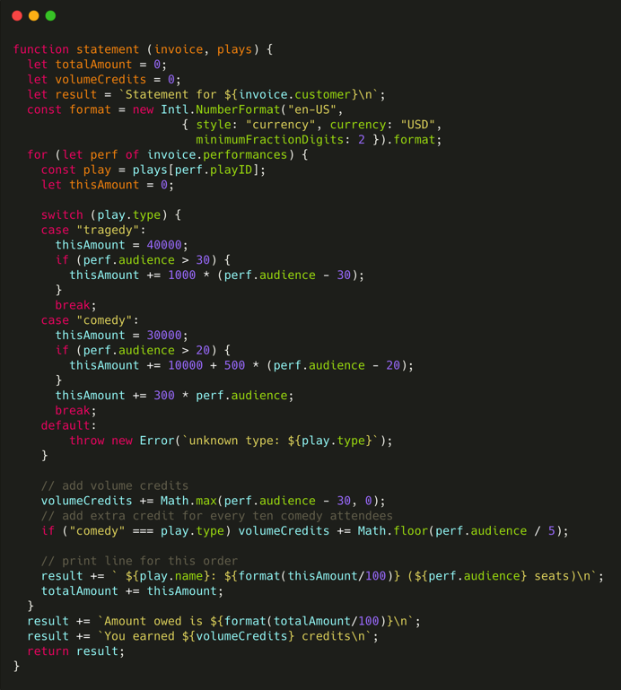
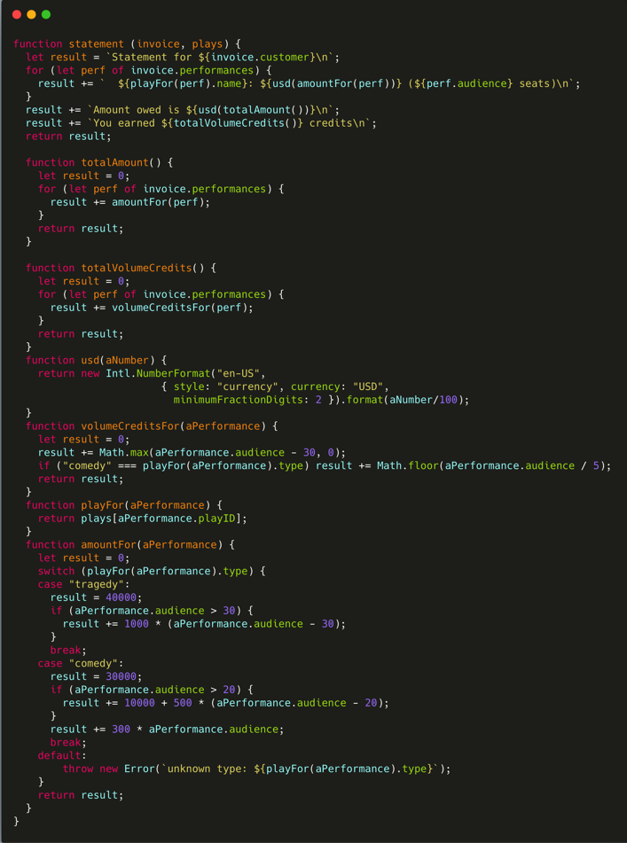
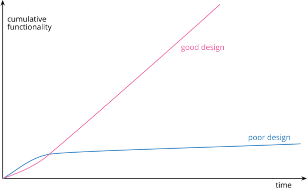

## The First Lesson

如果你要给程序添加一个特性，但发现代码因缺乏良好的结构而不易于进行更改，那就先重构那个程序，使其比较容易添加该特性，然后再添加该特性。



### Step 1

确保即将修改的代码拥有一组可靠的测试。这些测试必不可少，因为尽管遵循重构手法可以使我避免绝大多数引入bug的情形，但我毕竟是人，毕竟有可能犯错。

> 在数字时代，软件的名字就是脆弱。

### Next Step

重构手法：

- 基于关注点分离原则`提炼函数`(Extract Function)
- 以查询取代临时变量(Replace Temp with Query): 移除局部变量的好处就是做提炼时会简单得多，因为需要操心的局部作用域变少了。实际上，在做任何提炼前，我一般都会先移除局部变量。
- 内联变量(Inline Variable)
- 循环拆分(Split Loop)



### Support HTML as ouput format

需要支持 HTML 输出作为格式。

- 阶段拆分(Split Phase)
- Enrichment

```js
function enrichPerformance(aPerformance) {
  const result = Object.assign({}, aPerformance);
  result.play = playFor(result);
  return result;
}

function playFor(aPerformance) {
  return plays[aPerformance.playID];
}
```

- Replace Loop with Pipeline

```js
function totalAmount(data) {
  return data.performances
    .reduce((total, p) => total + p.amount, 0);
}
function totalVolumeCredits(data) {
  return data.performances
    .reduce((total, p) => total + p.volumeCredits, 0);
}
```

> 编程时，需要遵守营地法则 (Camping Rule): 保证你离开时代码库一定比来时更健康。

*My rule is a variation on the camping rule: Always leave the code base healthier than when you found it. It will never be perfect, but it should be better.*

重构到这里，变成了 `Model` -> `View`

### Support more categories of Plays

The core refactoring is `Replace Conditional with Polymorphism`, wich changes a hunk of conditional code with polymorphism.

> 好的代码的检验标准就是人们是否能轻而易举地修改它。

## Principles in Refactoring

### Defining Refactoring

- Refactoring (nonu): a change made to the internal structure of sotreware to make it easier to understand and cheaper to modify without changing its `observable behavior`.
- Refactoring (verb): to restructure softeware by applying a serias of refactorings without changing its `observable behavior`.

As a result, when I'm refactoring, my code doesn't spend much time in a broken state, allowing me to stop at any moment even if I haven't finished.

> If someone says their code was broken for a couple of days while they are refactoring, you can be pretty sure they were not refactoring.

### Refactoring vs Restructuring

I use “restructuring” as a general term to mean any kind of reorganizing or cleaning up of a code base, and see refactoring as a particular kind of restructuring. 

### Refactoring vs Performance Optimization

- `Refactoring` is always done to make the code “easier to understand and cheaper to modify.
- `Performance optimization`: I only care about speeding up the program, and am prepared to end up with code that is harder to work with if I really need that improved performance.

### The Two Hats

When I use refactoring to develop software, I divide my time between two distinct activities: adding functionality and refactoring.

- When I add functionality, I shouldn’t be changing existing code; I’m just adding new capabilities. I measure my progress by adding tests and getting the tests to work.
- When I refactor, I make a point of not adding functionality; I only restructure the code. I don’t add any tests (unless I find a case I missed earlier); 

### Why should we refactor

- Refactoring Improves the Design of Software
- Refactoring Makes Software Easier to Understand
- Refactoring Helps Me Find Bugs
- Refactoring Helps Me Program Faster



Design Stamina Hypothesis: By putting our effort into a good internal design, we increase the stamina of the software effort, allowing us to go faster for longer.

> [Silver Bullet](https://zh.wikipedia.org/wiki/%E9%8A%80%E8%89%B2%E5%AD%90%E5%BD%88)

### When should we refactor

> The Rule of Three: Here’s a guideline Don Roberts gave me: The first time you do something, you just do it. The second time you do something similar, you wince at the duplication, but you do the duplicate thing anyway. The third time you do something similar, you refactor.
Or for those who like baseball: Three strikes, then you refactor.

- Preparatory Refactoring—Making It Easier to Add a Feature

The best time to refactor is just before I need to add a new feature to the code base. As I do this, I look at the existing code and, often, see that if it were structured a little differently, my work would be much easier. 

- Comprehension Refactoring: Making Code Easier to Understand
- Litter-Pickup Refactoring(捡垃圾式重构)

As the old camping adage says, always leave the camp site cleaner than when you found it. If I make it a little better each time I pass through the code, over time it will get fixed. 

- Planned and Opportunistic Refactoring
- Long-Term Refactoring

To change from one library to another, start by introducing a new abstraction that can act as an interface to either library. Once the calling code uses this abstraction, it’s much easier to switch one library for another. (This tactic is called `Branch By Abstraction` [mf-bba].)

- Refactoring in a Code Review

### What Do I Tell My Manager?

I’m being paid for my expertise in programming new capabilities fast, and the fastest way is by refactoring—therefore I refactor.

### When Should I Not Refactor?

- If I run across code that is a mess, but I don’t need to modify it, then I don’t need to refactor it. Some ugly code that I can treat as an API may remain ugly. It’s only when I need to understand how it works that refactoring gives me any benefit.
- Another case is when it’s easier to rewrite it than to refactor it. This is a tricky decision. Often, I can’t tell how easy it is to refactor some code unless I spend some time trying and thus get a sense of how difficult it is. The decision to refactor or rewrite requires good judgment and experience, and I can’t really boil it down into a piece of simple advice.

### PROBLEMS WITH REFACTORING

- Slowing Down New Features

> The whole purpose of refactoring is to make us program faster, producing more value with less effort.

### Testing

One of the key characteristics of refactoring is that it doesn’t change the observable behavior of the program. 

### Legacy Code

The best advice I can give is to get a copy of `Working Effectively with Legacy Code` and follow its guidance.

To summarize crudely, it advises you to get the system under test by finding seams in the program where you can insert tests. Creating these seams involves refactoring—which is much more dangerous since it’s done without tests, but is a necessary risk to make progress.

### Database

Migration

### REFACTORING, ARCHITECTURE, AND YAGNI

This approach to design goes under various names: simple design, incremental design, or yagni [mf-yagni] (originally an acronym for “you aren’t going to need it”). 

## Bad Smells in code

> If it stinks, change it.

### Mysterious Name

When you can’t think of a good name for something, it’s often a sign of a deeper design malaise. Puzzling over a tricky name has often led us to significant simplifications to our code.

### Duplicated Code

### Long Function

### Long Paramater List

### Global Data

### Mutable Data

### Divergent Change

Divergent change occurs when one module is often changed in different ways for different reasons.

### Shotgun Surgery

Shotgun surgery is similar to divergent change but is the opposite. You whiff this when, every time you make a change, you have to make a lot of little edits to a lot of different classes. 

A useful tactic for shotgun surgery is to use inlining refactorings, such as Inline Function (115) or Inline Class (186), to pull together poorly separated logic. 

### Feature Envy

When we modularize a program, we are trying to separate the code into zones to maximize the interaction inside a zone and minimize interaction between zones.

### Data Clumps

### Primitive Obsession

### Repeated Switchs

### Loops

### Lazy Element

### Speculative Generality

### Temporary Field

### Message Chains

### Middle Man

### Insider Trading

### Large Class

### Alternative Classes with Different Interface

### Data Class

### Refused Bequest

### Comments

> 当你感觉需要撰写注释时，请先尝试重构，试着让所有注释都变得多余。

## Building Tests

测试应该是一种风险驱动的行为，我测试的目标是希望找出现在或未来可能出现的bug。所以我不会去测试那些仅仅读或写一个字段的访问函数，因为它们太简单了，不太可能出错。

### 自测试代码的价值

确实，修复 bug 往往比写代码所花的时间更多，而人人都会犯错。

### Probing the boundaries (探测边界条件)

通常聚焦于正常行为的用法被称为 "Happy Path"，它指的是一切工作正常、用户使用方式也最符合规范的那种场景。

> 考虑可能出错的边界条件，把测试火力集中在那儿。

> 每当你收到一个 bug 报告，请先写一个单元测试来暴露这个 bug.